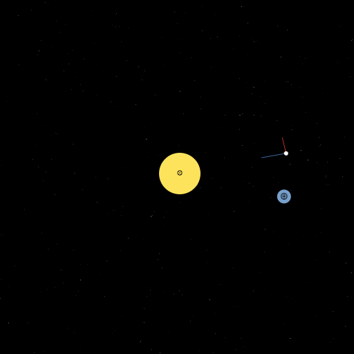

Gravity
=======

An orbital mechanics game written in Elm.

## Controls

Click or touch on the screen to apply thrust to your capsule.

## Demo

[Click here to try it out.](https://stephenbalaban.com/gravity-orbital-mechanics-game-written-elm/images/gravity.html)

## Run

Clone project and run in elm-reactor

## TODO

1. Multiplayer.
